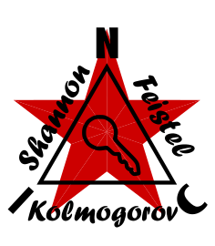

<p align="center">
  
</p>

*[English](README.md) · [Čeština](README_cs.md) · [Русский](README_ru.md)*

---
# NIC-KSF — Kolmogorov Shannon Feistel

## Šifrovací protokol pro embedded zařízení

[](https://opensource.org/licenses/MIT)

---

## Co je KSF?

NIC-KSF je odlehčená symetrická šifrovací knihovna postavená na blokové šifře **SPECK-128** v režimu **CTR (čítačový mód)**. Je navržena pro mikrokontroléry s omezenými prostředky, jako je ATmega328, kde je RAM a Flash vzácná a výpočetní náročnost musí být minimální.

Knihovna má jedinou jasnou odpovědnost: **zašifrovat nebo dešifrovat blok dat pomocí 128bitového klíče**. Veškerá správa klíčů, odvozování klíčů, správa relací a protokolová logika jsou záměrně přenechány vyšším vrstvám.

---

## Vlastnosti

- Bloková šifra SPECK-128/128
- Režim CTR — šifrování a dešifrování jsou identické operace (XOR keystreamu)
- Operace in-place — žádný pomocný buffer
- Podporuje libovolnou délku dat od 1 do 255 bajtů
- Žádná dynamická alokace paměti (`malloc`)
- Žádné závislosti kromě `<stdint.h>` a `<string.h>`
- Kompatibilní s AVR (ATmega328) a standardními překladači C99
- Dvě varianty implementace — viz níže

---

## Varianty implementace

Obě varianty sdílejí stejné rozhraní (`nic_ksf.h`) a produkují identické výsledky.

| Soubor | Popis |
|---|---|
| `nic_ksf_32.c` | Ruční 32bitová aritmetika — pro starší `avr-gcc` |
| `nic_ksf_64.c` | Nativní `uint64_t` — pro novější `avr-gcc` a PC |

Novější verze `avr-gcc` (Arduino IDE) dokáže přeložit nativní 64bitové operace do velmi efektivní sekvence instrukcí `add` / `adc`. Doporučujeme otestovat obě varianty a vybrat tu, která pro váš konkrétní projekt produkuje menší nebo rychlejší kód.

---

## Bezpečnostní model

NIC-KSF je **čistá kryptografická primitiva**. Nespravuje klíče, relace ani čítače paketů.

**Volající je odpovědný za to, že každé volání `ksf_encrypt` obdrží unikátní 128bitový klíč.**

Pokud by byl stejný klíč použit pro dva různé pakety, útočník by mohl provést XOR zachycených šifrovaných textů a keystream by se vzájemně vyruší. Zajištění unikátnosti klíče je plnou odpovědností volající vrstvy.

---

## Rozhraní (API)

```c
#include "nic_ksf.h"

/* Zašifruje data na místě pomocí 128bitového klíče.
 * key  : 16 bajtů (128 bitů) — připraví nadřazená vrstva
 * data : ukazatel na buffer (přepsán šifrovaným výsledkem)
 * len  : počet bajtů (1–255)
 */
void ksf_encrypt(const uint8_t key[KSF_KEY_SIZE], uint8_t *data, uint8_t len);

/* Dešifruje data na místě. V režimu CTR identické s ksf_encrypt. */
void ksf_decrypt(const uint8_t key[KSF_KEY_SIZE], uint8_t *data, uint8_t len);
```

---

## Příklad použití

```c
#include "nic_ksf.h"

/* 128bitový klíč připravený volající vrstvou */
uint8_t key[16] = { /* ... 16 bajtů ... */ };

/* Data k zašifrování */
uint8_t payload[20] = { /* ... data ... */ };

/* Zašifrování na místě */
ksf_encrypt(key, payload, sizeof(payload));

/* ... odeslání ... */

/* Dešifrování na straně příjemce */
ksf_decrypt(key, payload, sizeof(payload));
```

---

## Sestavení

### PC / Linux

```bash
# 32bitová varianta
gcc -std=c99 -Wall -Isrc -o test_ksf tests/test_ksf.c src/nic_ksf_32.c

# 64bitová varianta
gcc -std=c99 -Wall -Isrc -o test_ksf tests/test_ksf.c src/nic_ksf_64.c

./test_ksf
```

Nebo jednoduše spusťte `make` (sestaví a spustí obě varianty).

### AVR / ATmega328

```bash
avr-gcc -std=c99 -mmcu=atmega328p -Os -Isrc -o nic_ksf.elf src/nic_ksf_32.c
```

---

## Struktura projektu

| Cesta | Popis |
|---|---|
| `src/nic_ksf.h` | Veřejné rozhraní a konstanty |
| `src/nic_ksf_32.c` | Implementace SPECK-128 CTR — 32bit varianta |
| `src/nic_ksf_64.c` | Implementace SPECK-128 CTR — 64bit varianta |
| `python/nic_ksf.py` | Referenční implementace v Pythonu (testování) |
| `python/ksf_demo.py` | Ukázkový skript end-to-end |
| `tests/test_ksf.c` | Testovací sada v C |
| `tests/test_ksf.py` | Testovací sada v Pythonu |
| `Makefile` | Sestavení pro PC a AVR |
| `README_cs.md`, `README_ru.md` | Přeložená dokumentace (cs, ru) |

---

## Licence

MIT License — Copyright (c) 2026 NIC — Native Intellect Community

---

## Poděkování

Bratrovi za rady při tvorbě tohoto projektu.
Za technickou asistenci s optimalizací kódu AI asistentům Claude (Anthropic) a Gemini (Google).

★ Viva La Resistánce ★
