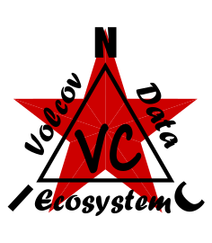

<p align="center">
  
</p>

# Volkov Data Ecosystem

*[English](README.md) · [Čeština](README_cs.md) · [Русский](README_ru.md)*


A cross-platform, two-pane file manager in the style of **Volkov Commander**,
written in Python on **prompt_toolkit**. It browses the local filesystem and
steps *inside* **NIC-MLA** containers, showing each logged record as a file.

> Status: **1.2** — built against **NIC-MLA v1.2**. Two-pane browsing, file
> operations, file/record viewer, and an MLA backend that browses and views
> records — with limited editing of the self-describing tables (not a general
> record editor, and not strictly read-only). MLA is a deliberately *dumb*
> container, so the backend leans on those tables: the **schema table** decodes
> each packed payload into real values + units, and the **station table** turns
> the log's 1-byte station index into real region/number — both flow straight
> into CSV/SQL export, and both are editable in place via the `F4` table editor.
>
> The design mirrors MLA's own philosophy — **dumb libraries + thin glue**:
> reusable, format-aware libraries underneath (`export`, plus the vendored MLA +
> its schema reader), with the backends as thin adapters on top. All of
> `volkov_core/` is GUI-free, so it can be reused headless.

## Run

```bash
pip install -r requirements.txt
python3 volkov_data.py [left_dir] [right_dir]
```

**Keys**

| Key | Action |
|---|---|
| `Tab` | switch panel |
| `↑/↓ PgUp/PgDn Home/End` | move cursor |
| `Enter` | open dir / step into `.mla` / go up (`..`) |
| `F1` | info about the selected item / record |
| `F2` | check an `.mla` container — report valid / dead / damaged slots |
| `F3` | view file or record payload (text/hex) |
| `F4` | on a record: decoded value(s) + units · on `..` inside an editable `.mla`: schema/station table editor |
| `F5` | copy selected file to the other panel |
| `F6` | rename or move — inside an `.mla`, export all records to CSV |
| `F7` | make directory |
| `F8` | delete (with confirmation) |
| `F9` | pull-down menu (sorting, language, export to SQL, …) |
| `F10` / `q` / `Ctrl-Q` | quit · `Esc` closes any overlay |

Press `Enter` on `samples/weather.mla` to step inside and browse its records.

## Tests

The `volkov_core/` logic is GUI-free, so it is covered by a stdlib `unittest`
suite (no extra dependencies):

```bash
python3 -m unittest discover -s tests
```

The tests build throwaway MLA containers on the fly and also smoke-test the
committed `samples/weather.mla`.

## Layout

```
volkov_data.py           prompt_toolkit GUI (thin shell over volkov_core)
volkov_core/             GUI-free logic — reusable headless
  backend.py               storage-backend abstraction (VdeEntry / VdeBackend)
  local.py                 VdeLocalBackend — host filesystem
  mla.py                   VdeMlaBackend — thin adapter: records as "files",
                           schema decode + station resolve + export
  export.py                dumb library — generic rows → CSV / SQLite bytes
  stations.py              glue — station index → real region/number
samples/make_sample.py   generator for a self-describing sample datalogger file
samples/weather.mla      committed sample (packed rows + schema + stations)
tests/                   stdlib unittest suite for volkov_core (GUI-free)
third_party/nic_mla/     vendored NIC-MLA (Python reference) — canonical data format
third_party/nic_dmd/     vendored NIC-DMD — decodes compressed (keyframe/delta) records
  tools/mla_schema.py      host-only schema/station builders + readers (VDE links)

The desktop reads the logger format through MLA's Python reference
(`third_party/nic_mla/nic_mla.py`) and decodes payloads + stations via the
host-only reader (`tools/mla_schema.py`), both kept byte-identical to the C core.
The Volkov Commander sources are a **behavior reference only** — not ported code.

```
## Datalogger (multi-profile)

Detect and export a datalogger `.mla` (several station profiles in one file): `volkov_core.datalogger` — `is_datalogger()` + `export_csv()` / `export_sqlite()`. Full spec in NIC-MLA `DESIGN-MLA-datalogger.md`.

## License

MIT License — Copyright (c) 2026 NIC — Native Intellect Community

---

## Acknowledgements

To my brother for advice during the development of this project.
For technical assistance with code optimisation, to AI assistants Claude (Anthropic) and Gemini (Google).

★ Viva La Resistánce ★
